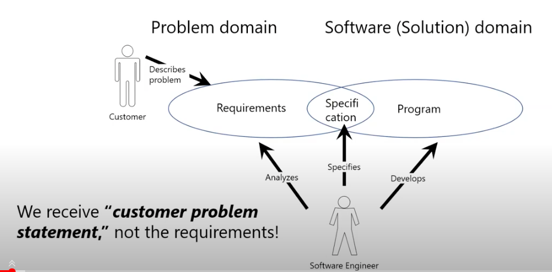

# Requirements 
เวลาที่เราจะสร้างอะไร คุณต้องรู้ก่อนว่า **คุณต้องรู้ก่อนว่าคุณต้องการอะไรบ้าง** โดยเนื้อหามักจะเกี่ยวกับ การได้บ้าง เนื่องจาก Requirements ที่แท้จริงและประเภทของ Requiremetns นั้นเอง และมีการวิเคราะห์อย่างไรบ้าง 

> Defination :  การได้มาของ Characteristics ของระบบโดยต้องตอบ **โจทย์ทั้ง** explicit and **Implicit**

- **Explit Need** ความต้องการของ user ที่สามารถเห็นได้ด้วยตาเปล่า 
- **Implicit Need** ความต้องการของ user ที่ไม่สามารเห็นได้ด้วยตา *( ยากต่อการแปลงเป็น requirements )*

## Domain for design solfware 

- **`Ploblem domain`** ยุ่งเกี่ยวกับการ เก็บข้อมูล โดยการอธิบายปัญหาของ customer และนำมา วิเคราะห์ 
	- โดยที่ สิ่งที่ ==user บอก = customer problem statement != requirements !== 
	- ไม่ควรเอาที่ user บอกนั้นมาทำ solution ในการแก้ปัญหาจริง เพราะสำหรับบางคน อาจมี bias !! 
	- นำ ==Requirements ( customer problem ที่ทำการวิเคราะห์แล้ว ) --> Specification --> Program== 
- **`Software` (solution) domain** 

---

## Problem Analysis  for Requirements
- **Problem** User is delayed to work and needs help 
	- `Cause A` Traffic is unpredicable 
	- `Cause B` User is unfamiliar with the route 
	- `Cause C` USe has a habit of starting rate 
โดยในบางที ไม่สามารถใช้  feture เดียวในการแก้ปัญหา ทั้งหมดได้ วิธีการคือ ==validate กับ user== 

### Requirements as User Stories 
> As a tenant ( user - role ) , I can unlock thdoors ( capability ), to enter my apartments ( business-value )

### The Requirements Engineering Process 
- **Feasibility Study**  => `Feasibility report`
- **Requirements *elicitation* and *analysis***  => `System models`
	>เป็นส่วนที่ทำให้มีปฎิสัมพันธ์ กับ User มากสุด โดยเวลาเก็บข้อมูลต้องเก็บทุก Stack holder ( ผู้มีส่วนได้ส่วนเสีย )
	โดยแต่ละ Stack holder อาจจะมี feature ที่มีความแตกต่างกันได้ 
	ปัญหาที่พบบ่อย : ในขั้น state of problem -> dont know what they really want / conflicting requirements 
- **Requirements  specification**  => `User and System Requirements`
- **Requirements  validation**  => `Requirements documents`
![[Screen Shot 2565-09-28 at 16.47.15.png | 600]]

### Requirements Analysis Process 
- **Domain understanding** 
- **Requirements collection**
- **Classification**
- **Conflict resolution**
- **-Prioritization**
- **Reequirements validation** 

### Tool for Respresentation Requirements 
- **Usecase diagram**
- **Scenarios**
- **User Interface Requirements **

### Summary Requirements 
#### Three type of problems 
- Lack of Claify เขียนไม่ดี ไม่กระจ่าง อ่านยาก
- Requirements confusion  ประสม function and function 
- Requirements amalgamation เอาหลายๆ rrequirements ตีกันมั่ว 

### Requirements Verification 
#### Precise Requirements Measure 
`speed` time to define a new committee 
`Size` Time to entire one conflict 
`Ease of use` 
`Reliability`
`Portability`

---

## Tyes of Requirements 
ในการแบ่งประเภทของ Requirements จะแบ่งเป็น 3 ประเภทด้วยกัน 
- **Functional **
- **Non Functional **
- **Constrains**

